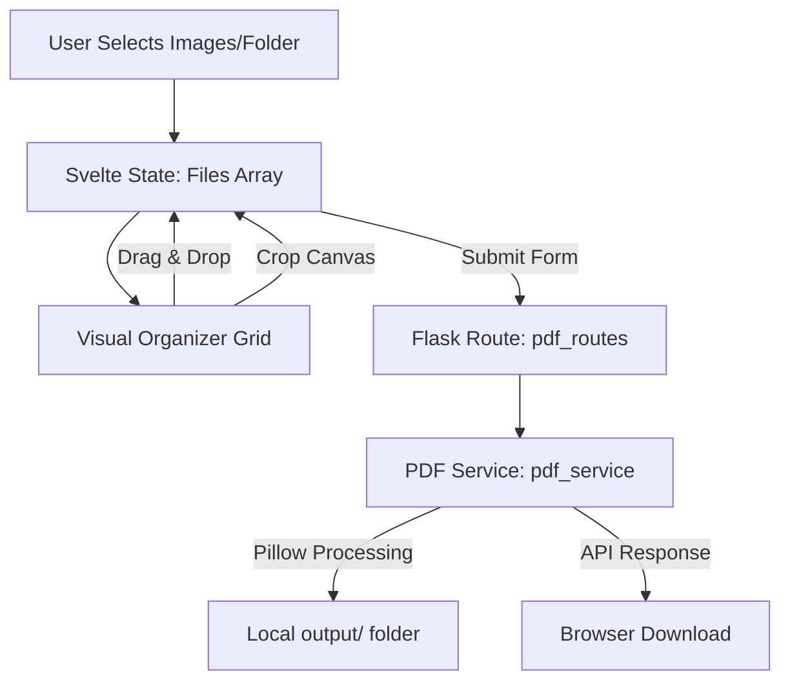

# scan_to_pdf - Architecture Documentation

This document explains the architecture, modular layout, and data flow of the `scan_to_pdf` application.

## System Overview

The application is structured into a modular Python backend (Flask) and a reactive frontend (Svelte + Vite).



---

## Modular Components

### 1. Frontend (Svelte)
- **`App.svelte`**: Central layout coordinator. Holds the state (`files` array containing image data/URLs) and acts as the event hub.
- **`DropZone.svelte`**: Encapsulates file drag-and-drop and standard file/folder selection using `webkitdirectory`.
- **`ImageGrid.svelte`**: Implements CSS Grid for previewing layout. Uses HTML5 Drag-and-Drop API to reorder the visual queue dynamically by swapping indices in the Svelte array.
- **`ImageCard.svelte`**: Renders each image thumbnail with controls for deletion and editing (cropping).
- **`CropModal.svelte`**: Features an HTML5 Canvas interface that lets users crop photos. When saved, the canvas yields a new image Blob, replacing the original file in the Svelte list.

### 2. Backend (Flask)
To ensure the backend can scale to support additional conversion types (e.g., OCR, PDF compression) in the future, the code is structured into separate layers:
- **`app.py`**: Boots the server and registers the blueprints/routes.
- **`routes/`**: Handles incoming API requests. Defines routes, processes multipart forms, and parses parameters.
- **`services/`**: The core business logic layer. Completely decoupled from the Flask request context, facilitating testing and reusability. Handles image decoding, format conversions (e.g., RGBA to RGB), and Pillow PDF rendering.

---

## Data Flow

1. **Selection & Ingestion**:
   - The user selects images or a folder.
   - Svelte creates client-side object URLs (`URL.createObjectURL(file)`) to display high-resolution thumbnails instantly without uploading files to the server.
2. **Editing (Cropping)**:
   - When a user crops an image, Canvas extracts the pixel data in the cropped box:
     ```javascript
     const croppedBlob = await new Promise(resolve => canvas.toBlob(resolve, 'image/jpeg'));
     ```
   - Svelte updates the file list array, replacing the raw file with the cropped Blob.
3. **Reordering**:
   - HTML5 drag handlers track the index swap and update Svelte's list.
4. **Compilation**:
   - On submission, Svelte packs the ordered files into a `FormData` object and posts it to `/api/pdf/merge`.
   - The Flask route parses files sequentially, passes them to the PDF Service, and uses Pillow to merge them:
     ```python
     images[0].save(output_path, save_all=True, append_images=images[1:])
     ```
   - The server saves the PDF in `backend/output/` and returns the file contents to the client for immediate download.
